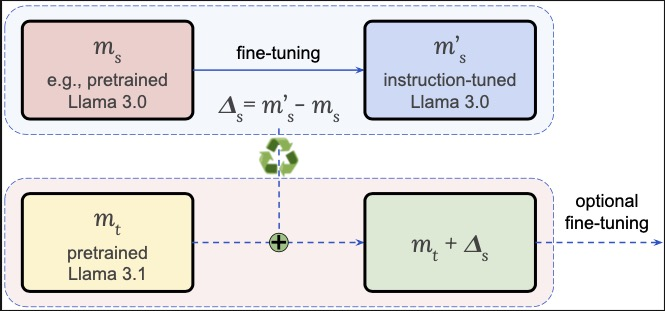

<div align="center">
  <h1>Efficient Model Development through Fine-tuning Transfer</h1>
  <p>Turn base models into instruction followers—by reusing fine-tuning updates, with no training required.</p>
</div>
<br>
<div align="center">
  
</div>

**Updates:**

- 2025.03: We released the paper and code.

This repository accompanies the paper ["Efficient Model Development through Fine-tuning Transfer"](https://arxiv.org/abs/2501.19393), providing code for all the results.

- [Quick Start](#quick-start)
- [Transfer Fine-tuning](#transfer-fine-tuning)
- [Training](#training)
- [Evaluation](#evaluation)


### Quick Start

#### Setup

* `python==3.10.0`
* `torch==2.4.0+cu121`


```bash
pip install --upgrade pip "setuptools<70.0.0" wheel 
# TODO: unpin setuptools when FlashAttention issue is resolved
pip install torch==2.4.0 torchvision==0.19.0 torchaudio==2.4.0 --index-url https://download.pytorch.org/whl/cu121
pip install packaging
pip install flash-attn==2.6.3 --no-build-isolation
pip install -r requirements.txt
python -m nltk.downloader punkt
pip install -e .
```

#### Installing Transformers

We use the commit (6c3f168) of the Transformers library.

```
pip install git+https://github.com/huggingface/transformers@6c3f168b36882f0beebaa9121eafa1928ba29633
```


## Transfer Fine-tuning

Yu can transfer fine-tuning updates using only open-weight models (see Section 1 of our paper) or specific fine-tuned models (see Section 4).
For example, get the diff between LLaMA 3.0 Instruct and LLaMA 3.0, then apply it to LLaMA 3.1.
Or reuse updates from your fine-tuned OLMo 2 model on another base model—no retraining needed.


### Recycling for Merged Model

Results using diff vectors on LLaMA models. For example, Δ₃.₀ is the weight changes between Llama 3.0 Instruct and Llama 3.0.


| Model                  | GSM8K | MATH | ARC_C | GPQA | MMLU | IFEval |
|---------------------------|-----------|----------|-----------|----------|----------|------------|
| Llama 3.0 8B Instruct  | 81.1      | 28.8     | 82.4      | **31.5** | 64.9     | **76.6**   |
| Llama 3.0 8B              | 55.6      | 17.3     | 79.7      | 22.3     | 66.7     | 34.5       |
| &nbsp;&nbsp;+ Δ₃.₁       | **82.8**  | **44.7** | **83.0**  | 25.9     | **70.0** | **76.6**   |
| Llama 3.1 8B Instruct  | **86.5**  | **50.3** | **83.8**  | 31.3     | **72.9** | 80.5       |
| Llama 3.1 8B              | 56.6      | 19.3     | 79.2      | 21.9     | 66.8     | 36.4       |
| &nbsp;&nbsp;+ Δ₃.₀       | 79.8      | 29.9     | 82.9      | **32.6** | 65.1     | **83.3**   |


##### Transfer fine-tuning

Transfer fine-tuning (or diff vector) from a fine-tuned model and base model to a target model. e.g.: `M5 + (FT(M4) - M4)`.

```bash
cd tools
python run_transfer_finetuning.py
```

You can work this with open-weight models like LLaMA or Tüulu 3—but no need to do fine-tuning by yourself.


### Training

##### Model Preparation

Save intermediate checkpoints of OLMo 2 7B (M4 and M5) and specific revisions to local folders.

```bash
bash scripts/run_save_models.sh
```

To work on open-weight models, one can use the HF models using a script. 


##### Fine-tuning

Fine-tuning is done using Open-Instruct on OLMo 2 7B intermediate checkpoints (M4 and M5) using the Tülu 3 math reasoning dataset (Persona MATH, GSM, Algebra).

```bash
# Run full fine-tuning on M4 or M5 checkpoint
bash train_math.sh
```


### Evaluation

We recommend using OLMEs for evaluation, as it provides a standardized and scalable interface—especially for large-scale benchmarks like MMLU.

Our evaluation pipeline uses OLMEs with a VLLM backend that has been modified to support the OLMo2 architecture. For setup instructions, including how to apply the necessary VLLM modifications, see `tools/olmes/olmes_installation_guide` in this repository.

To get started, install OLMEs (we suggest doing this in a separate environment), then run:

```bash
# Run full evaluation for post-trained models
cd tools/olmes
bash eval_it_olmo2.sh
```

Note: we're working to release LLaMA 3 and 3.1 evaluations


